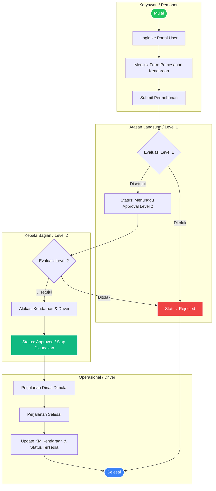

# 🚛 NikelPool - Sistem Manajemen Kendaraan Operasional Tambang Nikel

**NikelPool** adalah sistem informasi manajemen terpadu yang dirancang khusus untuk mengelola pemesanan, persetujuan berjenjang (multi-level approval), serta pemantauan armada kendaraan operasional di area pertambangan nikel dan kantor cabang. Sistem ini menggabungkan keandalan backend **Laravel 11**, antarmuka dinamis **React.js (Inertia.js)**, serta kecanggihan dashboard manajemen dari **Filament v3**.

---

## 🌟 Fitur Utama (Key Features)

1. **Pemesanan Kendaraan Operasional (Vehicle Booking)**
    - Karyawan dapat mengajukan permohonan pemesanan kendaraan untuk keperluan dinas, operasional tambang, atau penjemputan tamu VIP.
    - Pilihan lokasi tujuan yang terintegrasi dengan wilayah kerja (Kantor Pusat, Kantor Cabang, dan berbagai Site Tambang).

2. **Sistem Persetujuan Berjenjang (Multi-Level Approval)**
    - **Level 1 (Atasan Langsung/Supervisor):** Verifikasi awal kebutuhan dan urgensi perjalanan dinas.
    - **Level 2 (Kepala Bagian/Pool Manager):** Verifikasi lanjutan dan alokasi unit kendaraan serta pengemudi (driver).

3. **Manajemen Armada & Pengemudi (Fleet & Driver Management)**
    - Pencatatan lengkap data kendaraan (nomor polisi, merek, tahun, kapasitas, jenis BBM, kilometer saat ini, dan status ketersediaan).
    - Pengelolaan data pengemudi (SIM, masa berlaku, status aktif, dan penugasan).
    - Pemantauan riwayat servis pemeliharaan kendaraan (Vehicle Maintenance).

4. **Laporan & Ekspor Data (Reports & Analytics)**
    - Filter laporan pemesanan berdasarkan rentang tanggal dan status.
    - Ekspor laporan otomatis ke format Excel (`.xlsx`) untuk kebutuhan audit dan rekapitulasi manajemen.

5. **Catatan Jejak Audit (Activity Logging & Role Management)**
    - Menggunakan `spatie/laravel-permission` untuk pembagian hak akses (Super Admin, Admin Pool, Approver, Karyawan).
    - Menggunakan `spatie/laravel-activitylog` untuk merekam setiap perubahan data dan riwayat persetujuan.

---

## 🛠️ Teknologi yang Digunakan (Tech Stack)

- **Backend:** PHP 8.3, Laravel 11.x
- **Frontend / User Portal:** React.js 18, Inertia.js, Tailwind CSS, TypeScript
- **Admin Panel / Master Data:** Filament Admin Panel v3.x
- **Database:** PostgreSQL
- **Paket Pendukung:**
    - `spatie/laravel-permission` (RBAC)
    - `spatie/laravel-activitylog` (Audit Trail)
    - `maatwebsite/excel` (Export Excel)

---

## 📊 Activity Diagram (Alur Kerja Sistem)

Berikut adalah diagram alur aktivitas pemesanan kendaraan dari mulai pengajuan hingga perjalanan selesai:



---

## 🚀 Langkah-langkah Menjalankan Aplikasi

Berikut adalah panduan lengkap dari awal untuk menjalankan aplikasi **NikelPool** di lingkungan lokal Anda (Windows/Linux/Mac).

### 1. Prasyarat Sistem (Prerequisites)

Pastikan sistem Anda telah terinstal:

- **PHP** (minimal versi 8.3)
- **Composer** (versi 2.x)
- **Node.js** (minimal versi 18.x) & **NPM**
- **PostgreSQL** (pastikan service database aktif)
- **Git**

### 2. Kloning & Pengaturan Awal

Buka terminal/command prompt, lalu jalankan perintah berikut:

```bash
# 1. Masuk ke direktori proyek
cd NikelPool

# 2. Salin file konfigurasi environment
cp .env.example .env
```

Buka file `.env` dan sesuaikan konfigurasi koneksi database PostgreSQL Anda:

```env
DB_CONNECTION=pgsql
DB_HOST=127.0.0.1
DB_PORT=5432
DB_DATABASE=nikelpool
DB_USERNAME=postgres    # Sesuaikan dengan username postgres Anda
DB_PASSWORD=rahasia     # Sesuaikan dengan password postgres Anda
```

### 3. Instalasi Dependensi & Kredensial Database

Jalankan rangkaian perintah berikut untuk menginstal paket PHP, paket Node.js, menghasilkan _application key_, dan melakukan migrasi beserta pengisian data master (seeding):

```bash
# 1. Instal dependensi PHP
composer install

# 2. Generate Laravel App Key
php artisan key:generate

# 3. Lakukan migrasi database beserta Seeding Master Data
php artisan migrate:fresh --seed

# 4. Jalankan seeder khusus untuk data Kendaraan dan Pengemudi
php artisan db:seed --class=VehicleSeeder
php artisan db:seed --class=DriverSeeder

# 5. Instal dependensi Frontend (React/Tailwind)
npm install
```

### 4. Akun Default untuk Login (Seeder Credentials)

Proses seeding di atas secara otomatis membuat beberapa akun dengan peran (role) yang berbeda untuk memudahkan Anda menguji seluruh alur sistem:

| Peran (Role)                     | Email Login              | Password   | Akses Portal                     |
| :------------------------------- | :----------------------- | :--------- | :------------------------------- |
| **Super Admin / Admin Pool**     | `admin@nikelpool.com`    | `password` | `/admin` (Filament Admin Panel)  |
| **Approver 1 (Atasan Langsung)** | `approver@nikelpool.com` | `password` | `/dashboard` (User Portal React) |
| **Approver 2 (Kepala Bagian)**   | `kabag@nikelpool.com`    | `password` | `/dashboard` (User Portal React) |
| **Karyawan / User 1**            | `user1@nikelpool.com`    | `password` | `/dashboard` (User Portal React) |

---

### 5. Menjalankan Server Pengembangan (Development Servers)

Aplikasi ini membutuhkan dua server yang berjalan secara bersamaan (satu untuk backend Laravel, dan satu untuk compiler frontend Vite/React).

Buka **Terminal Pertama**, jalankan backend Laravel:

```bash
php artisan serve
```

_(Server backend akan berjalan di `http://127.0.0.1:8000`)_

Buka **Terminal Kedua**, jalankan _bundler_ frontend Vite:

```bash
npm run dev
```

_(Vite akan memantau perubahan file React/Tailwind secara real-time)_

---

## 🖥️ Panduan Penggunaan Singkat

1. **Membuat Permohonan (Sebagai Karyawan):**
    - Buka `http://127.0.0.1:8000/login`, masuk menggunakan `user1@nikelpool.com`.
    - Pilih menu **Pemesanan Kendaraan** -> Klik **Buat Pemesanan**.
    - Isi formulir tujuan, tanggal, dan alasan keperluan dinas.

2. **Melakukan Persetujuan Level 1 (Sebagai Atasan Langsung):**
    - Keluar (Logout), lalu masuk menggunakan `approver@nikelpool.com`.
    - Buka menu **Persetujuan (Approvals)**, klik tombol **Proses** pada permohonan yang berstatus _Pending Level 1_, lalu klik **Setujui**.

3. **Melakukan Persetujuan Level 2 & Alokasi (Sebagai Kepala Bagian):**
    - Keluar (Logout), lalu masuk menggunakan `kabag@nikelpool.com`.
    - Buka menu **Persetujuan (Approvals)**, pilih permohonan yang berstatus _Pending Level 2_, pilih kendaraan dan driver yang tersedia, lalu klik **Setujui**.

4. **Manajemen Master Data (Sebagai Admin Pool):**
    - Buka `http://127.0.0.1:8000/admin`, masuk menggunakan `admin@nikelpool.com`.
    - Anda dapat mengelola seluruh data master seperti Pengguna, Kendaraan, Pengemudi, Wilayah, serta melihat Log Aktivitas sistem.

---

**© 2026 NikelPool Mining Fleet Management System. All rights reserved.**
